# Trade Copier MT4
*MQL4 (MetaTrader 4)* 

The system of copying trades works through communication via **the Discrod server**. Below we will discuss the different parts that communicate together in the direction **Publisher → Discrod server ← Receiver**, along with their description and settings.

## Discord server
All communication takes place through **channels** created on the **Discord server**. Each member of the server has its own **authentication token** and each channel within the server has its own **ID**. If we're talking about private channels and different restrictions on communication in created channels, it's good to keep in mind that both *Publisher* and *Receiver* simulate the behavior of **member** on **Discord server** according to **authentication token**, so if I want to copy trades from a hidden channel, then the member with the given authentication token that uses *Receiver* must have access to it. However, I assume that this is a server of a small circle of friends, and so hidden channels will not need to be addressed.

The following steps related to the **Discord server** section "require" a basic understanding of the **Discord** platform. Alternatively, all the procedures below are easily traceable across the Internet.

**Reasons why Discord server is several:**
- Transparency for the average user
- Transaction history
- Server/channel variations
- Security

### Developer mode
- Enabling developer mode makes it easier to get the **ID** of each **channel**.

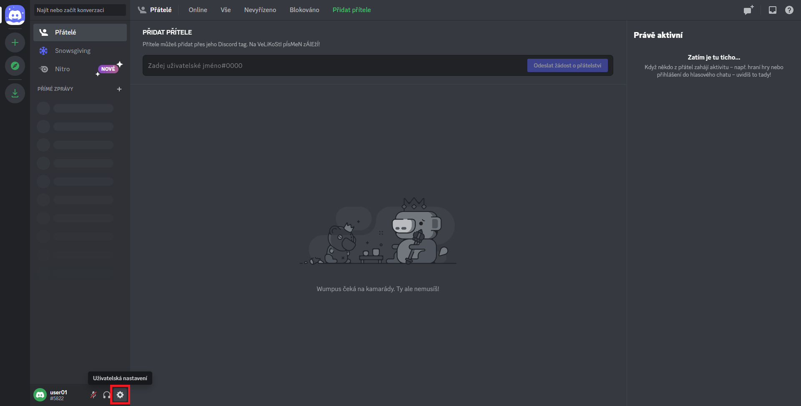&nbsp;&nbsp;&nbsp;&nbsp;

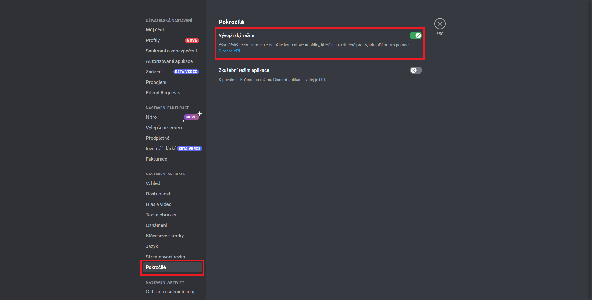&nbsp;&nbsp;&nbsp;&nbsp;

### 1. Creating a server
- One team member creates a server for him and his friends.

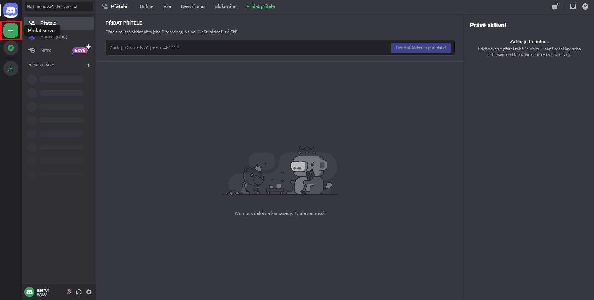&nbsp;&nbsp;&nbsp;&nbsp;

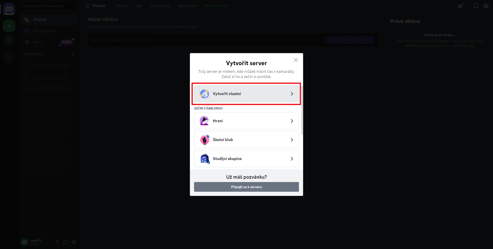&nbsp;&nbsp;&nbsp;&nbsp;

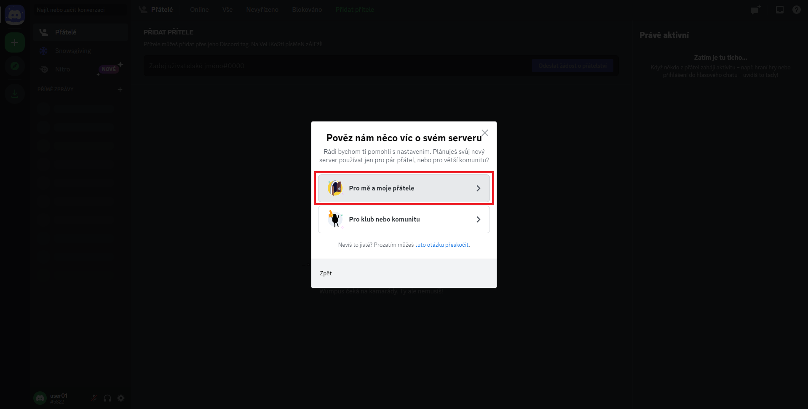&nbsp;&nbsp;&nbsp;&nbsp;

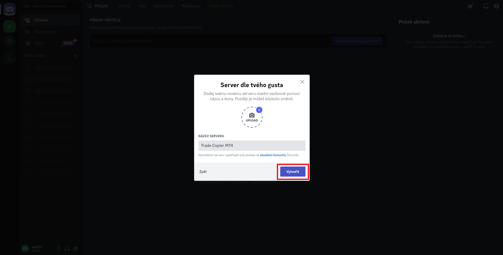&nbsp;&nbsp;&nbsp;&nbsp;

### 2. Invite friends to the server
- The server founder, or whoever has the right to create the invitation, will invite the rest of the team.

### 3. Create a text channel on the server
- The channel must be **text**!
- The naming is arbitrary, but it makes sense to name it with the Publisher's name (+ the symbol that the transactions will be shared with, if the Publisher chooses to restrict transaction sharing to individual symbols).

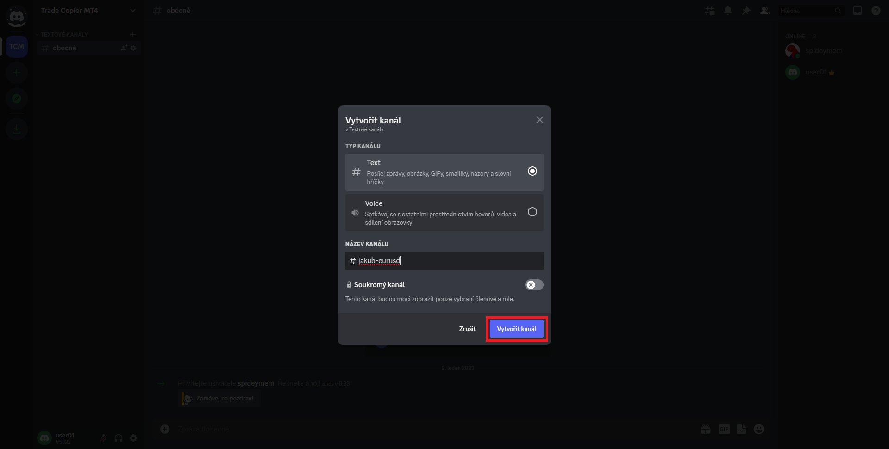&nbsp;&nbsp;&nbsp;&nbsp;

### 4. Getting the channel ID

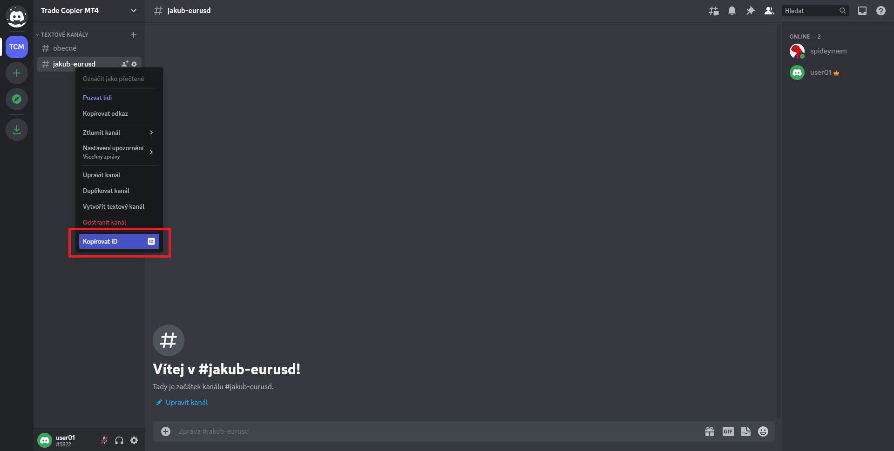&nbsp;&nbsp;&nbsp;&nbsp;

### 5. Obtaining an Authentication Token
- Unfortunately, this is a slightly more "complicated" way to obtain this token, but you only need to perform this step once within a single server and store the token aside for possible reuse (when accessing single channels via MT4). Instead of describing the steps here, I will include some links that deal with extracting the token. Alternatively, just ask google verbatim.
- Google Chrome
	- https://www.youtube.com/watch?v=YEgFvgg7ZPI
	- **Beware of leading and trailing quotes (""), they are not part of the token!**
- Console of other browsers (otherwise same procedure as above)
	- https://balsamiq.com/support/faqs/browserconsole/

## MetaTrader 4
### Enable discrod api address
- In this step we enable the MT4 platform to communicate with the Discord server. 

**Tools → Options → Strategies**
- Here we check the box **Enable WebRequest for URL list**.
- Then enter the address `https://discord.com`
- Confirm with the **OK** button.

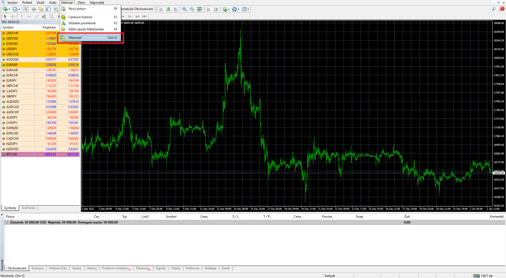&nbsp;&nbsp;&nbsp;&nbsp;

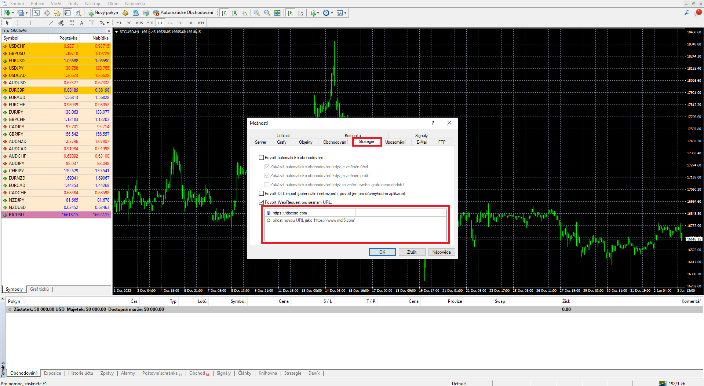&nbsp;&nbsp;&nbsp;&nbsp;

### Enabling algorithmic trading
- In this step we will make sure that we have enabled **Automatic Trading** within the MT4 platform.

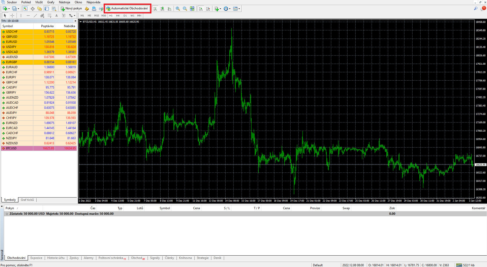&nbsp;&nbsp;&nbsp;&nbsp;

## Publisher.mq4
As the name suggests, this is a program for the MT4 platform that handles **sending transactions to the Discrod server**. 

### Input parameters
- **Channel ID**
- \>> Discord channel ID
- **Authorization Key**
- \>>> User's Discord authentication token
- **Server Delay**
- \>> Simulated delay in milliseconds when communicating with the Discord server. The default value is set to 10 ms, the smallest possible value is 1 ms. Entering 0 will automatically reset it to 10 ms, which I recommend to keep.
- **Allow Symbols**
- Transactions of the symbols listed, separated by a comma, have permission to be sent to the Discord server. If the input field is left blank, all trades made on all symbols will be shared. Example of input: EURUSD,BTCUSD,USDCHF

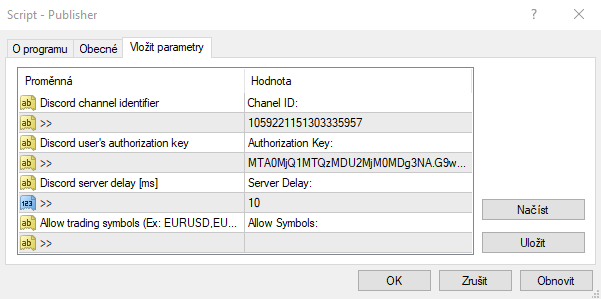&nbsp;&nbsp;&nbsp;&nbsp;

## Receiver.mq4
As the name suggests, this is a program for the MT4 platform that handles **transaction processing from the Discrod server**. 

### Input parameters
- **Channel ID**
- \>> Discord channel ID
- **Authorization Key**
- \>>> User's Discord authentication token
- **Publisher Account**
- \>> Account ID of the MT4 account whose transactions within the channel we want to eavesdrop on
- **Server Delay**
- \>> Simulated delay in milliseconds when communicating with the Discord server. The default value is set to 300 ms, the smallest possible value is 300 ms. Entering a value less than 300 will automatically cause it to be reset to 300 ms, which I recommend leaving.
- **Min Lots**
- \>> The minimum value of the trading lot quantity. If there is an incoming transaction with a smaller traded value, the transaction will automatically open at the input value. The default value is set to 0, which implicitly imposes no restrictions, and thus a 1:1 copy occurs. Each symbol provided has a minimum that is automatically guarded (usually 0.01 lots).
- **Max Lots**
- \>> Maximum value of the trade lot amount. If the value is exceeded in an incoming transaction, the transaction is automatically opened at the input value. The default value is set to 0, which does not implicitly place any restrictions, and therefore a 1:1 copy occurs. Each symbol provided has a maximum that is automatically guarded (usually 100 lots) .
- **Percent Lots**
- \>> The traded value in an incoming transaction is automatically recalculated (percentage) by the input value. By default, the value is set to 100 (%), which implicitly does not impose any recalculation of the traded value, and therefore copies 1:1.
- **Risk Percentage**
- \>> Setting the inherent risk based on (simulated) capital for transactions with a non-zero stop-loss value. The default value is set to 0, where it copies 1:1.
- **Simulated Balance**
- The simulated capital value from which we want to calculate the risk based on the previous input value **Risk Percentage**. The default value is set to 0, where in case of a non-zero **Risk Percentage** value, a recalculation will be made from the current value of available capital in the account (*Account Equity*).
- **Allow Open Trade**
- **true**/**false** related to the permission to accept open trades.
- **Allow Close Trade**
- \>> **true**/**false** related to the permission to accept close trades.
- **Allow Modify Trade**
- \>> **true**/**false** related to the permission to accept modification trades.
- **Invert Order**
- \>> **true**/**false** relating to inverse execution of an incoming transaction.
- **Min Free Margin**
- \>> Minimum *Free Margin* value to execute a transaction. Default value is set to 0.
- **Symbol Prefix Adjust**
- \>> If transactions are copied from another broker, which may have some symbols with different names, then we need to specify their names to achieve a mapping of the broker's *Publisher* and broker's *Receiver* symbols. By default, the input value is empty, and thus no copied symbol between brokers has a different name. Example input: EURUSD=EuroUsd,BTCUSD=BtcUsd,USDCHF=UsdChf.
- **Allow Symbols**
- Transactions of the symbols listed, separated by a comma, have permission to be executed. If the input field is left blank, all shared transactions from *Publisher* will be executed. Example input: EURUSD,BTCUSD,USDCHF

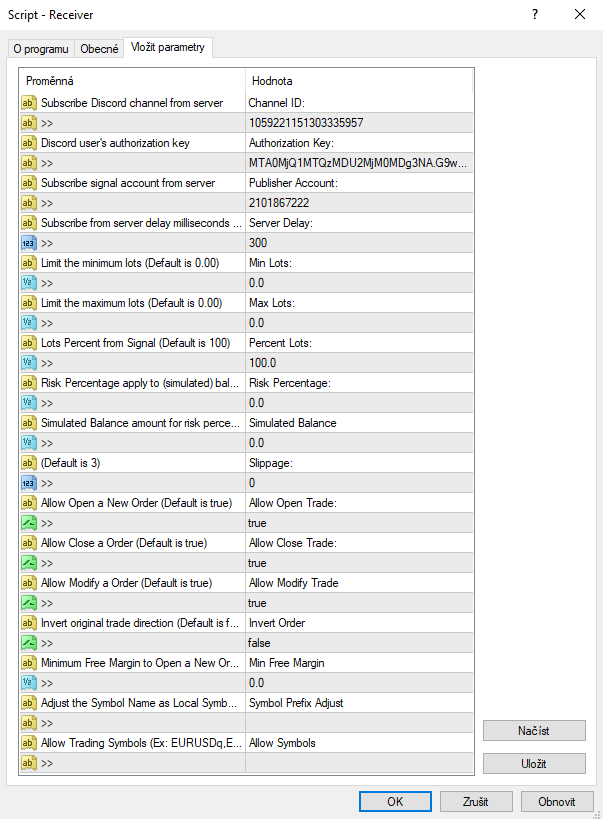&nbsp;&nbsp;&nbsp;&nbsp;

## Uvedení do provozu
### 1. Publisher START
- Spuštěním **Publisher.mq4** dojde k odeslání informativní zprávy vybranému kanálu o **START STREAM** stavu společně se sdílenými symboly **SYMBOLS**.

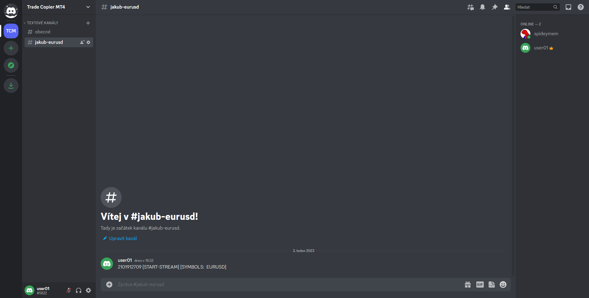
&nbsp;&nbsp;&nbsp;&nbsp;

### 2. Receiver START
- Spuštěním **Receiver.mq4** dojde ke skenování poslední zprávy vybraného kanálu.

### 3. Publisher provádí transakce
- Provedenou transakci program zpracuje a odešle serveru v daném formátu. 

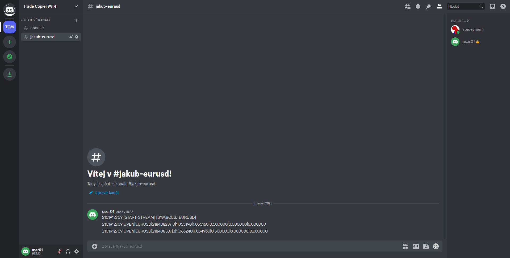
&nbsp;&nbsp;&nbsp;&nbsp;

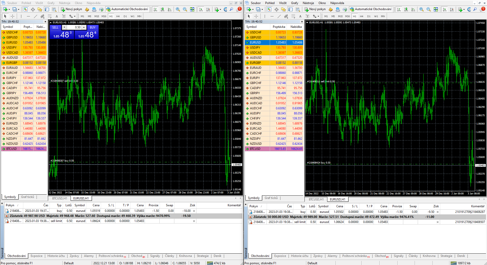
&nbsp;&nbsp;&nbsp;&nbsp;

### 4. Publisher STOP
- Ukončením programu dojde k odeslaní informativní zprávy vybranému kanálu o **STOP STREAM** stavu.

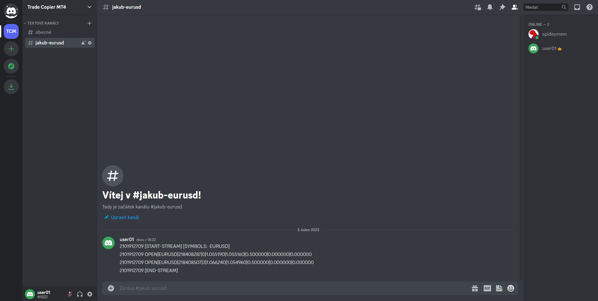
&nbsp;&nbsp;&nbsp;&nbsp;

### Description of the message
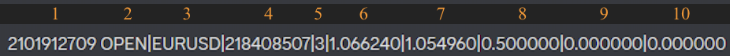
&nbsp;&nbsp;&nbsp;&nbsp;

1. **MT4 Account number**
2. **Order type** *(text description)*
3. **Order symbol**
4. **Order ticket**
5. **Order type** *(number description - https://docs.mql4.com/constants/tradingconstants/orderproperties)*
6. **Order Open price**
7. **Order Close price**
8. **Order lots**
9. **Order Stop loss**
10. **Order Take profit**

The sequence of the steps may be modified, but it is important to note: If the *Receiver* connects to a channel after a transaction has been executed, or during a broadcast by the *Publisher*, it must be assumed that, as the *Receiver*, it will process the last transaction delivered to that channel and therefore that it will be executed on its MT4 account if it is an *Open* transaction. If it is a different type of transaction, it will not be executed.

## A few words in conclusion
- It is necessary to run **Publisher.mq4*/*Receiver.mq4** with identical input parameter settings only once on an MT4 account (for one channel on the server). For example: if a user had **Receiver.mq4** run with identical input parameters 10 times, then one transaction would be executed 10 times. This can happen if the user has many chart windows open and has left the program running on several of them. It does not matter on which graph window the program will run. It is necessary that only one runs within a single setup.
- Don't overload the channels with *Publishers* unnecessarily to avoid spamming the channel every second, it depends on the frequency of the trades.

